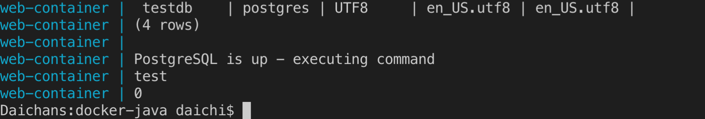

# 動作確認方法

##  データのインサート

コンテナの起動
```bash
$ docker-compose up -d
```

DBへ接続

```bash
$ docker-compose exec db psql -U postgres testdb
psql (10.6)
Type "help" for help.

testdb=\# insert into centerinfo VALUES ('0', 'test');
INSERT 0 1
```

## ログの確認

コンテナを再起動

```bash
$ docker-compose up -d
```

webコンテナのログを確認
```bash
$ docker-compose logs web
Attaching to web-container
web-container |                                  List of databases
web-container |    Name    |  Owner   | Encoding |  Collate   |   Ctype    |   Access privileges
web-container | -----------+----------+----------+------------+------------+-----------------------
web-container |  postgres  | postgres | UTF8     | en_US.utf8 | en_US.utf8 |
web-container |  template0 | postgres | UTF8     | en_US.utf8 | en_US.utf8 | =c/postgres          +
web-container |            |          |          |            |            | postgres=CTc/postgres
web-container |  template1 | postgres | UTF8     | en_US.utf8 | en_US.utf8 | =c/postgres          +
web-container |            |          |          |            |            | postgres=CTc/postgres
web-container |  testdb    | postgres | UTF8     | en_US.utf8 | en_US.utf8 |
web-container | (4 rows)
web-container |
web-container | PostgreSQL is up - executing command
web-container |                                  List of databases
web-container |    Name    |  Owner   | Encoding |  Collate   |   Ctype    |   Access privileges
web-container | -----------+----------+----------+------------+------------+-----------------------
web-container |  postgres  | postgres | UTF8     | en_US.utf8 | en_US.utf8 |
web-container |  template0 | postgres | UTF8     | en_US.utf8 | en_US.utf8 | =c/postgres          +
web-container |            |          |          |            |            | postgres=CTc/postgres
web-container |  template1 | postgres | UTF8     | en_US.utf8 | en_US.utf8 | =c/postgres          +
web-container |            |          |          |            |            | postgres=CTc/postgres
web-container |  testdb    | postgres | UTF8     | en_US.utf8 | en_US.utf8 |
web-container | (4 rows)
web-container |
web-container | PostgreSQL is up - executing command
web-container | test
web-container | 0
web-container |                                  List of databases
web-container |    Name    |  Owner   | Encoding |  Collate   |   Ctype    |   Access privileges
web-container | -----------+----------+----------+------------+------------+-----------------------
web-container |  postgres  | postgres | UTF8     | en_US.utf8 | en_US.utf8 |
web-container |  template0 | postgres | UTF8     | en_US.utf8 | en_US.utf8 | =c/postgres          +
web-container |            |          |          |            |            | postgres=CTc/postgres
web-container |  template1 | postgres | UTF8     | en_US.utf8 | en_US.utf8 | =c/postgres          +
web-container |            |          |          |            |            | postgres=CTc/postgres
web-container |  testdb    | postgres | UTF8     | en_US.utf8 | en_US.utf8 |
web-container | (4 rows)
web-container |
web-container | PostgreSQL is up - executing command
`web-container | 0`
```

最下行にテーブルにインサートされたデータが出力されています。

